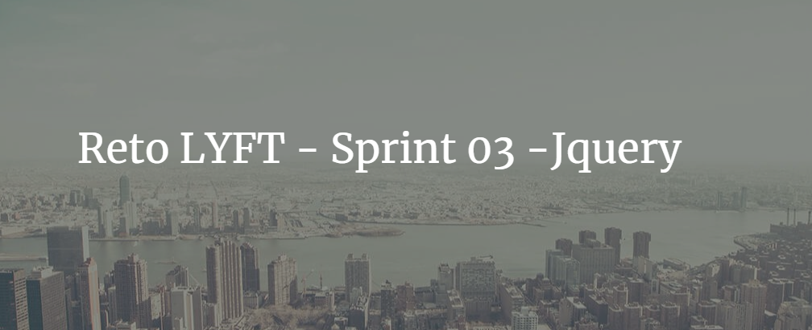
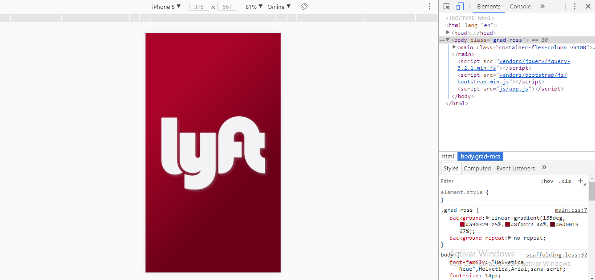
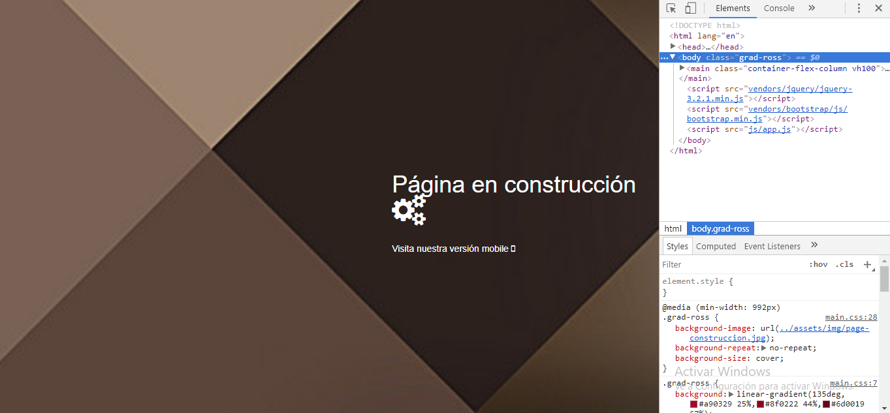

**Objetivos**
Desarrollar una web-app que replique el sitio de Lyft, en este reto se deberá cumplir los pasos necesarios para que el usuario pueda registrarse.

**Recursos**
En este reto hacemos uso de los framework y de librerías de Java Script vistos en esta unidad.

* [Bootstrap](https://getbootstrap.com/docs/3.3/css/)
* [Jquery](https://jquery.com/)

**Producto**

Dirigido para móviles

Mensaje para desktop

